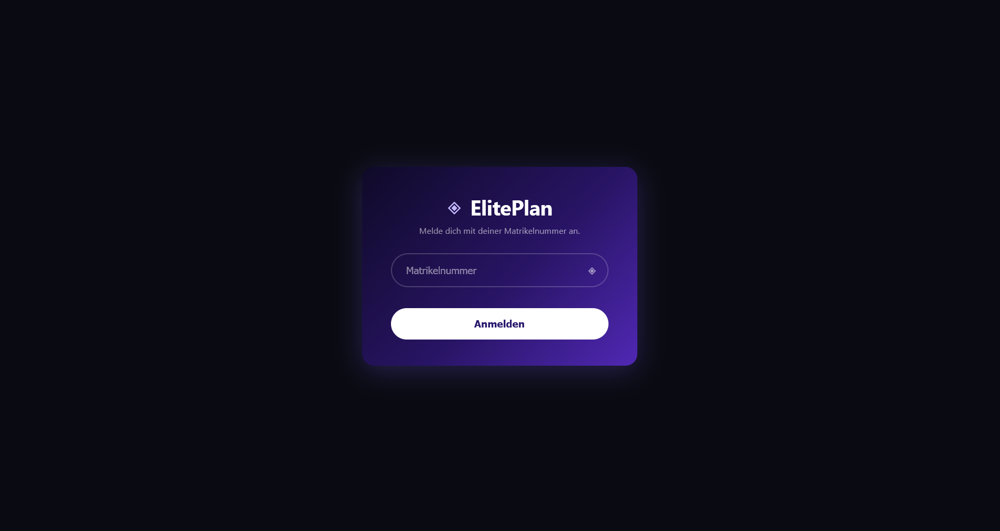
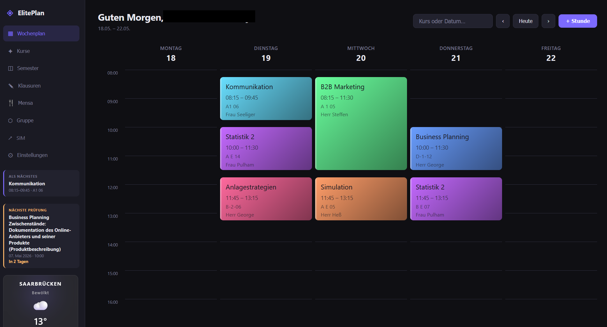
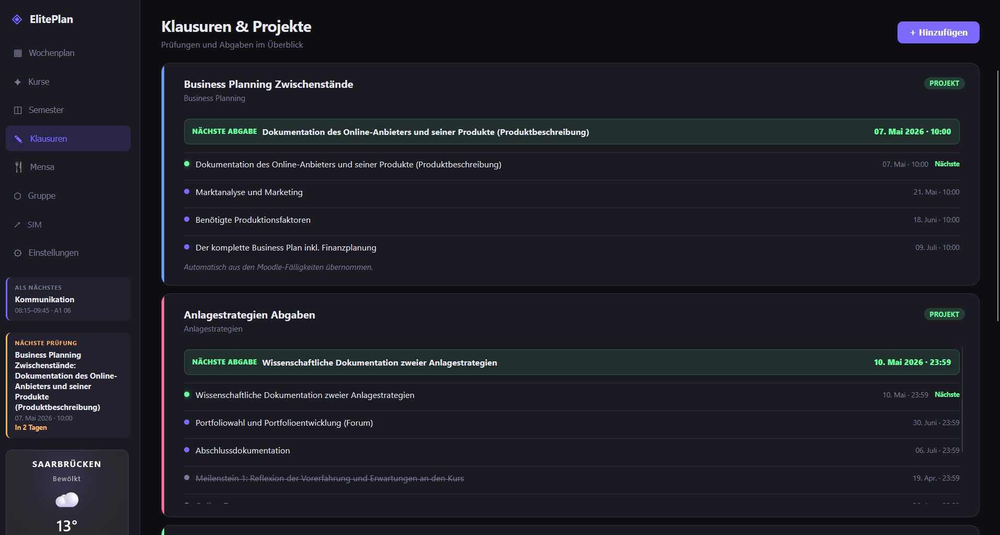
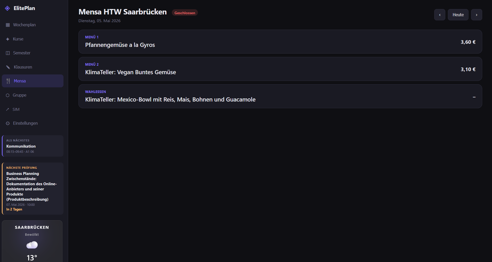
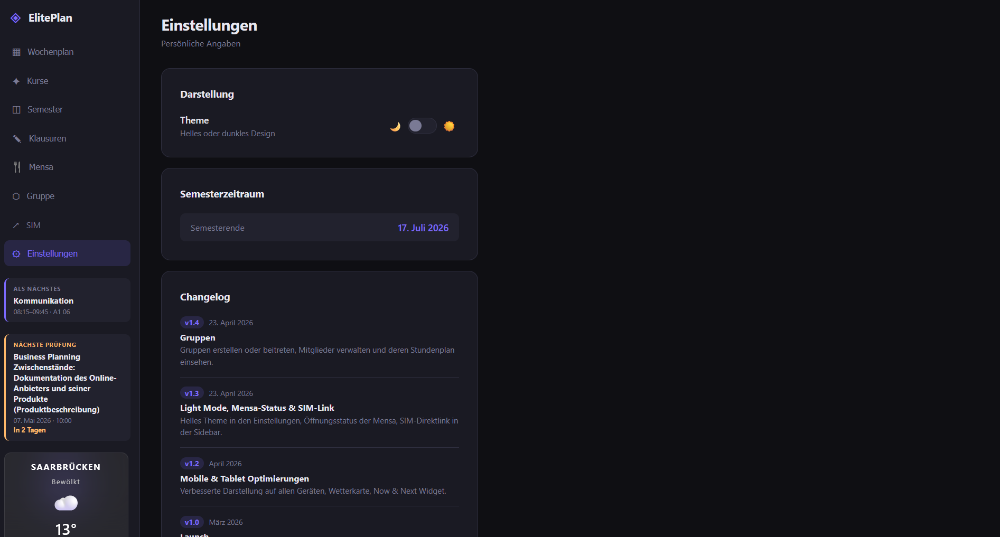

<div align="center">

# ◈ ElitePlan

**Der smarte Stundenplan für Studierende der HTW Saar**

Wochenplan · Kurse · Klausuren · Mensa · Lerngruppen — alles an einem Ort.

[](#changelog)
[](#)
[](#)
[](https://htwsaar.de)

</div>

---

## Über das Projekt

**ElitePlan** ist eine moderne Web-App, die alle wichtigen Infos rund ums Studium an der HTW Saar in einer übersichtlichen Oberfläche bündelt. Statt Stundenplan, Klausurtermine, Mensaplan und Moodle-Abgaben in fünf verschiedenen Tabs zu jagen, hast du hier alles auf einen Blick — schick verpackt, dunkel oder hell, am Desktop und auf dem Handy.

Das Projekt ist als **Progressive Web App (PWA)** gebaut, lässt sich also wie eine native App auf Smartphone oder Desktop installieren und funktioniert auch offline.

> Erstellt von  für den Studiengang Wirtschaftsingenieurwesen.

---

## Highlights

<div align="center">

### Login per Matrikelnummer
*Minimalistisch, schnell, ohne Passwort-Zirkus.*


### Wochenplan
*Farbcodierte Kurse, Now-&-Next-Widget, Wetter und nächste Prüfung in der Sidebar.*


### Klausuren & Projekte
*Projekte mit Meilensteinen, automatischen Moodle-Fälligkeiten und Countdown.*


### Mensa
*Tagesmenü der HTW Saarbrücken inkl. Live-Status (geöffnet / geschlossen).*


### Einstellungen & Changelog
*Theme-Switch, Semesterende und alle Updates auf einen Blick.*


</div>

---

## Features

### Wochenplan
- Übersichtlicher Wochenplan mit Drag-and-Drop-Feeling
- Wöchentliche und einmalige Stunden frei kombinierbar
- Kalenderwoche, Wochennavigation und „Heute"-Sprung
- **Now & Next**-Widget zeigt dir live, was gerade läuft und was als Nächstes kommt
- Suchleiste für Kurse oder Datum (`05.05.` oder `2026-05-05`)

### Kurse
- Eigene Fächer mit Dozent, Raum, Farbe und Moodle-Direktlink
- Farbkodierung über den ganzen Plan hinweg
- Schnelles Bearbeiten und Löschen per Modal

### Semester
- Vorgefertigte Studienpläne (z. B. Wirtschaftsingenieurwesen Bachelor – Semester 6)
- Kurse mit einem Klick übernehmen
- Semesterende immer im Blick

### Klausuren & Projekte
- Klausurtermine mit Datum, Uhrzeit und Raum
- Projekt-Modus mit beliebig vielen **Meilensteinen** (z. B. Moodle-Abgaben)
- Automatische Vorlagen für gängige Kurse (Anlagestrategien, Business Planning, B2B Marketing, …)
- Nächste Prüfung direkt in der Sidebar

### Mensa
- Tagesaktueller Speiseplan der **HTW Saar Rotenbühl**
- Live-Status: Mensa **geöffnet** oder **geschlossen**
- Vor- und Zurück-Navigation durch die Wochentage

### Gruppen
- Lerngruppe erstellen oder per Einladungscode beitreten
- Mitglieder verwalten
- Stundenplan deiner Gruppenmitglieder einsehen — perfekt für gemeinsame Pausen oder Lernsessions

### Komfort
- **Dark Mode** & **Light Mode** umschaltbar
- Wetter-Widget für Saarbrücken in der Sidebar
- Direktlink zu **SIM** (HTW-Portal)
- **PWA**: Installierbar auf Handy & Desktop, läuft offline
- **Auto-Sync** über Supabase – auf allen Geräten
- Liebevoll gestaltete UI mit dezenten Animationen

---

## Account erstellen

ElitePlan benutzt deine **Matrikelnummer** als Login — kein E-Mail-Bestätigungs-Krampf, kein extra Passwort merken.

### So geht's

1. Öffne ElitePlan im Browser oder als installierte PWA.
2. Gib deine **Matrikelnummer** ein und klicke auf **Anmelden**.
3. **Beim ersten Mal:** Die App fragt dich nach deinem **Namen**.
   Vorname und Nachname eingeben → fertig. Der Account wird automatisch im Hintergrund angelegt.
4. **Ab dem zweiten Mal:** Einfach Matrikelnummer eingeben — du bist drin. Dein Login bleibt auf dem Gerät gespeichert.

> **Hinweis:** Bekannte Matrikelnummern aus der Lerngruppe werden mit einem **Seed-Stundenplan** vorbefüllt — du musst nichts mehr von Hand eintragen.

### Daten & Privatsphäre

- Deine Daten liegen in einer **Supabase**-Datenbank mit aktivierter **Row Level Security**.
- Jede:r Nutzer:in sieht ausschließlich die eigenen Kurse, Stunden und Klausuren.
- Nichts wird mit Dritten geteilt.

---

## Tech Stack

| Layer | Technologie |
| --- | --- |
| **Frontend** | Vanilla JS (ES6+), HTML5, CSS3 |
| **Backend** | [Supabase](https://supabase.com) (Postgres + Auth + RLS) |
| **PWA** | Service Worker, Web App Manifest |
| **APIs** | Open-Meteo (Wetter), HTW-Saar Mensa API |
| **Hosting** | Statisches Hosting (z. B. Vercel, Netlify, GitHub Pages) |

Kein Framework-Overhead, kein Build-Step — pures Web.

---

## Selbst hosten

Du willst deine eigene Instanz hosten? So einfach geht's:

```bash
git clone https://github.com/SpookyyQ/stundenplan.git
cd stundenplan
```

1. **Supabase-Projekt** anlegen → `schema.sql` im SQL-Editor ausführen.
2. Migrations aus `supabase/migrations/` der Reihe nach ausführen.
3. In `app.js` `SUPABASE_URL` und `SUPABASE_KEY` durch deine Werte ersetzen.
4. `index.html` über einen beliebigen statischen Webserver ausliefern.

```bash
# Versionshash für Cache-Busting aktualisieren
node bump-version.js
```

---

## Changelog

### `v1.4` — 23. April 2026 · **Gruppen**
Gruppen erstellen oder per Code beitreten, Mitglieder verwalten und deren Stundenplan einsehen. Perfekt für Lernteams.

### `v1.3` — 23. April 2026 · **Light Mode, Mensa-Status & SIM-Link**
- Helles Theme in den Einstellungen
- Live-Öffnungsstatus der Mensa direkt im Header
- Direktlink zum SIM-Portal in der Sidebar

### `v1.2` — April 2026 · **Mobile & Tablet Optimierungen**
- Verbesserte Darstellung auf allen Geräten
- Wetterkarte für Saarbrücken
- **Now & Next**-Widget in der Sidebar

### `v1.0` — März 2026 · **Launch**
- Stundenplan, Klausuren, Mensa, Kursverwaltung und Semesterübersicht
- Login per Matrikelnummer
- Dark-Mode UI

---

## Credits

<div align="center">

**ElitePlan** wurde von  entwickelt.

Wetterdaten: [Open-Meteo](https://open-meteo.com) · Mensa-Daten: HTW Saar · Auth & DB: [Supabase](https://supabase.com)

`◈ ElitePlan` — Made for HTW Saar Students

</div>
